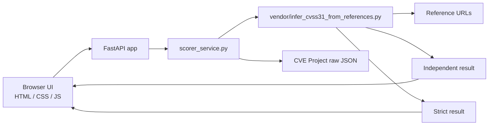

<p align="center"><strong>REFERENCE-BASED CVSS v3.1</strong></p>

<h1 align="center">CVSS Re-score Workbench</h1>

<p align="center">
  Review published scores, inspect evidence-backed metric changes, and keep raw output one click away.
</p>

<p align="center">
  <code>FastAPI</code>
  <code>Strict Mode</code>
  <code>Evidence View</code>
  <code>Render Ready</code>
</p>

Reference-based CVSS v3.1 scoring app built with FastAPI and a lightweight browser UI. It fetches a CVE record, pulls the referenced advisories, runs the bundled re-score engine in both normal and strict modes, and presents the result in an analyst-friendly view with optional raw JSON.

The app accepts standard CVE IDs in the form `CVE-YYYY-NNNN` and longer, including both older 4-digit sequences and newer 5+ digit sequences.

## What It Does

- Re-scores a CVE from references instead of trusting the published vector blindly
- Compares published vs. inferred CVSS side by side
- Shows strict mode results when unsupported metrics should remain undetermined
- Surfaces evidence snippets, changed metrics, fallback usage, and confidence
- Keeps the raw backend response available as an optional view

## App Flow

```text
User enters CVE ID
        |
        v
FastAPI fetches CVE JSON from CVEProject
        |
        v
Bundled scorer reads references and descriptions
        |
        +--> Independent mode
        |
        +--> Strict mode
        |
        v
UI renders summary, details, evidence, and optional raw JSON
```

## Architecture



## Interface Highlights

```text
+---------------------------+
| Header + CVE input        |
+---------------------------+
| At a glance               |
| published | rescored      |
| delta     | confidence    |
+---------------------------+
| Summary cards             |
| Details                   |
| Evidence                  |
| Raw JSON (optional)       |
+---------------------------+
```

## Project Layout

```text
cvss-scorer-app/
|- app.py
|- scorer_service.py
|- requirements.txt
|- render.yaml
|- static/
|  |- index.html
|  |- app.css
|  `- app.js
`- vendor/
   `- infer_cvss31_from_references.py
```

## Run Locally

```powershell
Set-Location C:\Users\vgera\cvss-scorer-app
python -m pip install -r requirements.txt
python -m uvicorn app:app --reload
```

Open `http://127.0.0.1:8000`.

Examples:

- `CVE-2026-4366`
- `CVE-2026-32746`

## Example API Call

```powershell
Invoke-RestMethod `
  -Uri "http://127.0.0.1:8000/api/analyze" `
  -Method Post `
  -ContentType "application/json" `
  -Body '{"cve_id":"CVE-2026-32746"}'
```

## Response Shape

```json
{
  "cve_id": "CVE-2026-32746",
  "analysis": {
    "vector": "CVSS:3.1/...",
    "score": 9.4,
    "severity": "CRITICAL",
    "confidence": "low"
  },
  "strict_analysis": {
    "vector": null,
    "score": null,
    "severity": null
  }
}
```

## Scoring Modes

| Mode | Behavior | Use case |
|---|---|---|
| Independent | Uses reference evidence and falls back when support is missing | Fast comparison and practical triage |
| Strict | Leaves unsupported metrics undetermined | Conservative review and analyst validation |

## Security Notes

- Temporary CVE download artifacts are request-scoped and cleaned up automatically
- The API does not return internal filesystem paths
- Raw JSON is optional in the UI and intended for analyst review

## Deploy To Render

This repo already includes [render.yaml](/Users/vgera/cvss-scorer-app/render.yaml).

Render uses:

- Build command: `pip install -r requirements.txt`
- Start command: `uvicorn app:app --host 0.0.0.0 --port $PORT`

Typical deploy flow:

1. Push this repo to GitHub.
2. In Render, create a new `Web Service`.
3. Connect the repo.
4. Let Render use `render.yaml`.
5. Deploy and test `POST /api/analyze`.

## Key Files

- App entry: [app.py](/Users/vgera/cvss-scorer-app/app.py)
- Backend wrapper: [scorer_service.py](/Users/vgera/cvss-scorer-app/scorer_service.py)
- Bundled scorer: [infer_cvss31_from_references.py](/Users/vgera/cvss-scorer-app/vendor/infer_cvss31_from_references.py)
- Frontend: [index.html](/Users/vgera/cvss-scorer-app/static/index.html)
- Styles: [app.css](/Users/vgera/cvss-scorer-app/static/app.css)
- Client logic: [app.js](/Users/vgera/cvss-scorer-app/static/app.js)
