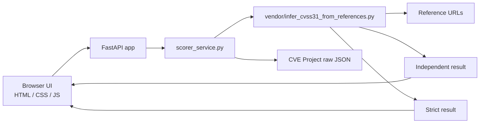

<p align="center"><strong>REFERENCE-BASED CVSS v3.1</strong></p>

<h1 align="center">CVSS Re-score Workbench</h1>

<p align="center">
  Review published scores, inspect evidence-backed metric changes, and keep raw output one click away.
</p>

<p align="center">
  <a href="https://github.com/vgg-dev/cvss-rescore-app/actions/workflows/ci.yml"></a>
  <a href="https://cvss-rescore-app.onrender.com"></a>
  <code>FastAPI</code>
  <code>Strict Mode</code>
  <code>Evidence View</code>
  <code>Render Ready</code>
</p>

CVSS Re-score Workbench is a FastAPI app for reference-based CVSS v3.1 analysis. It fetches CVE records, re-evaluates supporting references, and returns both an independent score and a strict no-fallback result through a lightweight browser UI and API.

The app accepts standard CVE IDs in the form `CVE-YYYY-NNNN` and longer, including both older 4-digit sequences and newer 5+ digit sequences.

Live deployment:

- [App](https://cvss-rescore-app.onrender.com)
- [Swagger UI](https://cvss-rescore-app.onrender.com/docs)
- [ReDoc](https://cvss-rescore-app.onrender.com/redoc)
- [OpenAPI JSON](https://cvss-rescore-app.onrender.com/openapi.json)

## Quick Start

1. Open the [live app](https://cvss-rescore-app.onrender.com).
2. Try a CVE such as `CVE-2026-4366` or `CVE-2026-32746`.
3. Inspect the generated API docs at [Swagger UI](https://cvss-rescore-app.onrender.com/docs).

## What It Does

- Re-scores a CVE from references instead of trusting the published vector blindly
- Compares published vs. inferred CVSS side by side
- Shows strict mode results when unsupported metrics should remain undetermined
- Surfaces evidence snippets, changed metrics, fallback usage, and confidence
- Keeps the raw backend response available as an optional view

## App Flow

```text
User enters CVE ID
        |
        v
FastAPI fetches CVE JSON from CVEProject
        |
        v
Bundled scorer reads references and descriptions
        |
        +--> Independent mode
        |
        +--> Strict mode
        |
        v
UI renders summary, details, evidence, and optional raw JSON
```

## Architecture



## Project Layout

```text
cvss-scorer-app/
|- app.py
|- scorer_service.py
|- tests/
|  |- test_app.py
|  `- test_scorer_service.py
|- requirements.txt
|- render.yaml
|- static/
|  |- index.html
|  |- app.css
|  `- app.js
`- vendor/
   `- infer_cvss31_from_references.py
```

## Run Locally

```powershell
git clone https://github.com/vgg-dev/cvss-rescore-app.git
Set-Location .\cvss-rescore-app
python -m pip install -r requirements.txt
python -m uvicorn app:app --reload
```

Open `http://127.0.0.1:8000`.

API documentation:

- Swagger UI: `http://127.0.0.1:8000/docs`
- ReDoc: `http://127.0.0.1:8000/redoc`
- OpenAPI JSON: `http://127.0.0.1:8000/openapi.json`

Examples:

- `CVE-2026-4366`
- `CVE-2026-32746`

## Example API Call

```powershell
Invoke-RestMethod `
  -Uri "http://127.0.0.1:8000/api/analyze" `
  -Method Post `
  -ContentType "application/json" `
  -Body '{"cve_id":"CVE-2026-32746"}'
```

Typical responses include published vs. rescored values, strict-mode output, confidence, and evidence-quality fields.

The generated API docs include:

- typed request and response schemas
- endpoint summaries and descriptions
- example request values
- documented error responses for `400`, `404`, `429`, `500`, `502`, `503`, and `504`

For scoring internals, see [CVSS Metric Inference Rules](docs/metric-rules.md).

## Run Tests

Install dependencies first if you have not already run the local setup steps.

```powershell
python -m pytest
```

Current regression coverage focuses on:

- CVE ID parsing for both 4-digit and 5+ digit sequences
- HTTP responses for `/` and `/api/analyze`
- request-scoped temporary directory cleanup
- service output passthrough at the API layer

## Response Shape

```json
{
  "cve_id": "CVE-2026-32746",
  "analysis": {
    "vector": "CVSS:3.1/...",
    "score": 9.4,
    "severity": "CRITICAL",
    "confidence": "low"
  },
  "strict_analysis": {
    "vector": null,
    "score": null,
    "severity": null
  }
}
```

## Common API Errors

| Status | When it happens | Example |
|---|---|---|
| `400` | The CVE ID format is invalid | `NOT-A-CVE` |
| `404` | The CVE JSON does not exist upstream | Reserved or mistyped CVE |
| `429` | Too many analyze requests from the same client | Repeated `/api/analyze` calls |
| `500` | The bundled scorer failed or returned invalid JSON | Local execution/scoring failure |
| `502` | The app cannot fetch the upstream CVE JSON | Network or upstream availability issue |
| `503` | The scorer is busy and cannot queue the request | Concurrent scorer saturation |
| `504` | The scorer exceeded its execution timeout | Slow references or scorer execution |

## Scoring Modes

| Mode | Behavior | Use case |
|---|---|---|
| Independent | Uses reference evidence and falls back when support is missing | Fast comparison and practical triage |
| Strict | Leaves unsupported metrics undetermined | Conservative review and analyst validation |

## Limitations

- Reference text can be incomplete, noisy, or inconsistent across advisories.
- Fallback-heavy independent results should be reviewed by an analyst.
- Strict mode may intentionally return no final score when the references do not support enough metrics.

See also:

- [Contributing Guide](CONTRIBUTING.md)
- [Security Policy](SECURITY.md)

## Deploy To Render

This repo already includes [render.yaml](render.yaml).

Render uses:

- Build command: `pip install -r requirements.txt`
- Start command: `uvicorn app:app --host 0.0.0.0 --port $PORT`

Typical deploy flow:

1. Push this repo to GitHub.
2. In Render, create a new `Web Service`.
3. Connect the repo.
4. Let Render use `render.yaml`.
5. Deploy and test `POST /api/analyze`.

## Key Files

- App entry: [app.py](app.py)
- Backend wrapper: [scorer_service.py](scorer_service.py)
- Bundled scorer: [infer_cvss31_from_references.py](vendor/infer_cvss31_from_references.py)
- Metric rules: [metric-rules.md](docs/metric-rules.md)
- Frontend: [index.html](static/index.html)
- Styles: [app.css](static/app.css)
- Client logic: [app.js](static/app.js)
- Tests: [tests/test_scorer_service.py](tests/test_scorer_service.py), [tests/test_app.py](tests/test_app.py)
